# 🍕 PROYECTO 7: Aplicación Fullstack de Comercio Electrónico (Pizzería)

Bienvenido al proyecto final del Bootcamp UDD: una aplicación eCommerce de pizzas desarrollada con **React + Vite** (frontend) y **Node.js + Express + MongoDB** (backend). Incluye autenticación, carrito, pagos con Stripe, historial de compras y despliegue profesional.

---

## 🌐 Enlaces rápidos

### 🚀 **Frontend**
- **GitHub:** [proyecto7final (frontend)](https://github.com/Alexis5900/proyecto7final)
- **Demo en Render:** [https://proyecto7final.onrender.com/](https://proyecto7final.onrender.com/)

### 🛠️ **Backend**
- **GitHub:** [proyecto7 (backend)](https://github.com/Alexis5900/proyecto7)
- **Demo en Render:** [https://proyecto7-0wl1.onrender.com/](https://proyecto7-0wl1.onrender.com/)

### 📄 **Documentación Swagger (API)**
- [https://proyecto7-0wl1.onrender.com/api-docs](https://proyecto7-0wl1.onrender.com/api-docs)

---

## 📖 Descripción

Esta aplicación permite a los usuarios:
- Explorar un catálogo de pizzas dinámico.
- Agregar productos al carrito con animaciones y feedback visual.
- Registrarse, iniciar sesión y recuperar contraseña.
- Realizar pagos de prueba con Stripe.
- Ver historial de compras y editar su perfil.
- Navegar de forma fluida gracias a React Router y un diseño profesional.

---

## 🚀 Instalación y ejecución local

```bash
# Clona el repositorio backend
git clone https://github.com/Alexis5900/proyecto7.git
cd proyecto7/backend
npm install
npm start
```

El backend estará disponible en: [http://localhost:3005/](http://localhost:3005/)

---

## ⚙️ Variables de entorno necesarias

Crea un archivo `.env` en la raíz del backend con:

```
MONGODB_URI=tu_uri_de_mongodb
SECRET=tu_clave_secreta
STRIPE_SECRET_KEY=tu_clave_stripe
FRONTEND_URL=https://proyecto7final.onrender.com
BACKEND_URL=https://proyecto7-0wl1.onrender.com
```

---

## 🧩 Funcionalidades principales

- Catálogo de productos dinámico desde la base de datos
- Carrito de compras con animaciones y feedback
- Registro, login, perfil, historial de compras
- Integración real con Stripe
- Recuperación de contraseña vía email de prueba (Ethereal)
- Rutas protegidas y validaciones
- Documentación Swagger para la API
- Despliegue profesional en Render

---

## 🌐 Consumo de API y documentación

El backend expone la API RESTful para autenticación, productos y compras.

- **Documentación Swagger:** [https://proyecto7-0wl1.onrender.com/api-docs](https://proyecto7-0wl1.onrender.com/api-docs)
- Puedes probar todos los endpoints, ver los parámetros y respuestas esperadas.

---

## 🧪 Pruebas rápidas con Postman

Puedes probar la API directamente con Postman usando las siguientes URLs base:

- **Producción:** `https://proyecto7-0wl1.onrender.com`
- **Local:** `http://localhost:3005`

### **Principales endpoints disponibles:**

| Método | Endpoint                                 | Descripción                                 |
|--------|------------------------------------------|---------------------------------------------|
| POST   | /api/usuarios/registro                   | Registrar usuario                           |
| POST   | /api/usuarios/login                      | Iniciar sesión                              |
| GET    | /api/usuarios/verificar-usuario          | Verificar usuario autenticado (token)       |
| POST   | /api/usuarios/recuperar-password         | Recuperar contraseña                        |
| GET    | /api/usuarios/compras                    | Historial de compras (token)                |
| GET    | /api/productos                           | Listar productos                            |
| POST   | /api/productos                           | Crear producto                              |
| DELETE | /api/productos/{id}                      | Eliminar producto                           |
| POST   | /api/checkout/create-checkout-session    | Crear sesión de pago con Stripe             |

Consulta la [documentación Swagger](https://proyecto7-0wl1.onrender.com/api-docs) para ver detalles de cada endpoint, parámetros y ejemplos de request/response.

---

## 📦 Estructura de carpetas relevante

- `/controllers` – Lógica de negocio de la API
- `/models` – Modelos de datos (Mongoose)
- `/routes` – Rutas de la API
- `/middleware` – Middlewares de autenticación y validación
- `/scripts` – Scripts de utilidad
- `/public/images` – Imágenes de pruebas y documentación

---

## 🧪 Pruebas y ejemplos

Puedes probar el flujo completo:
- Registrando un usuario
- Iniciando sesión
- Agregando pizzas al carrito
- Realizando un pago de prueba (Stripe test)
- Revisando el historial de compras en el perfil

---

## 📷 Capturas de ejemplo

A continuación se muestran capturas reales del flujo de la aplicación y pruebas realizadas:

### 1. Poblar productos (Postman)
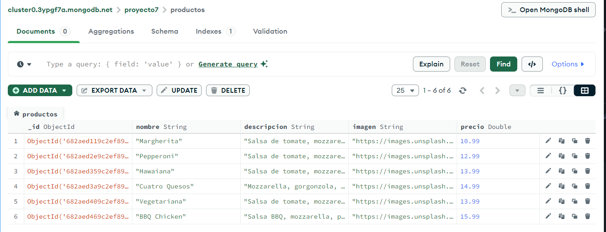

### 2. Poblar productos (Frontend)
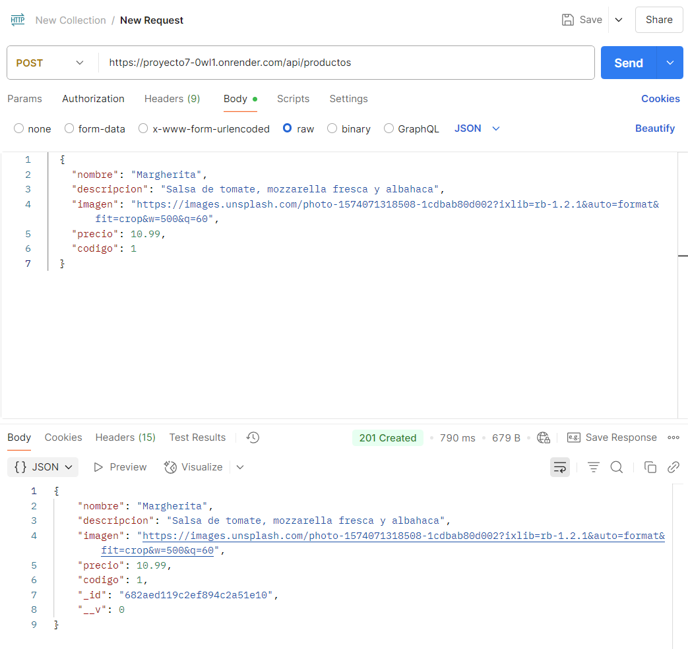

### 3. Pantalla de inicio
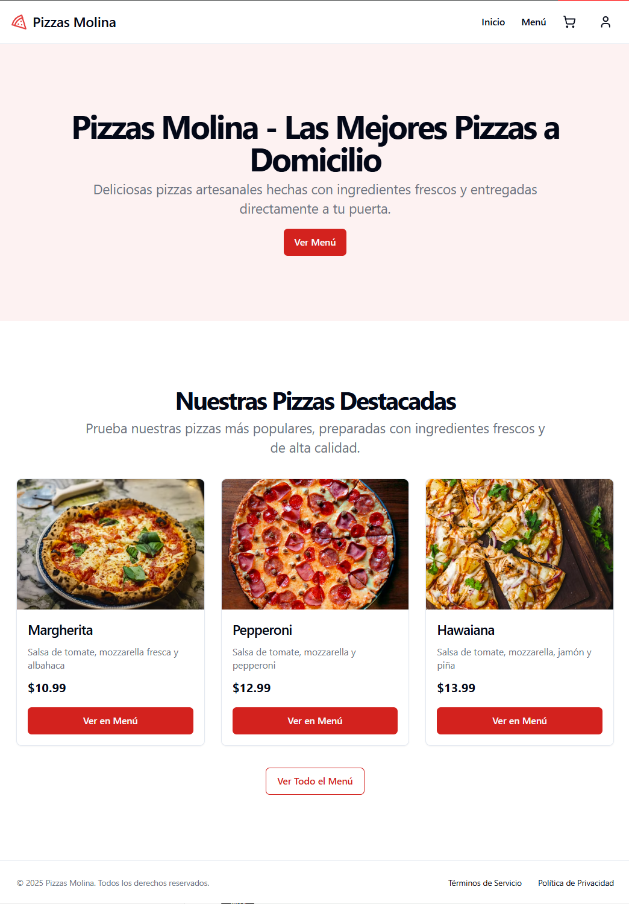

### 4. Catálogo de pizzas
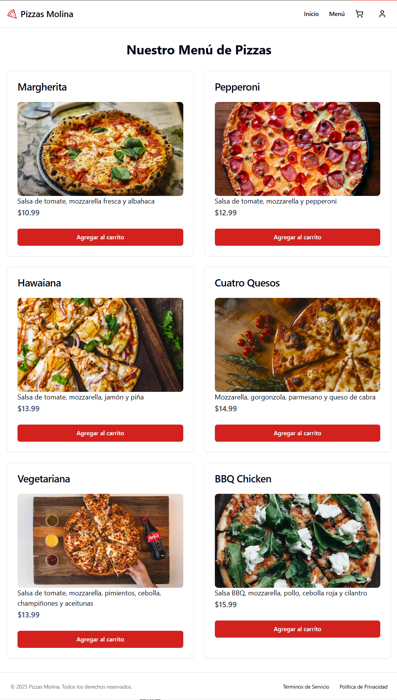

### 5. Creación de cuenta
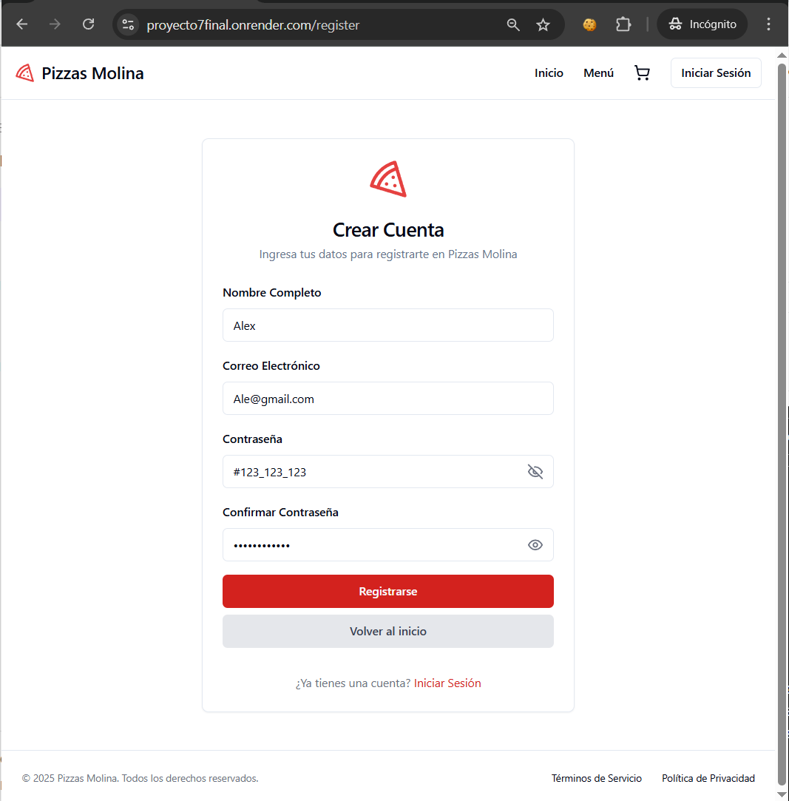

### 6. Inicio de sesión
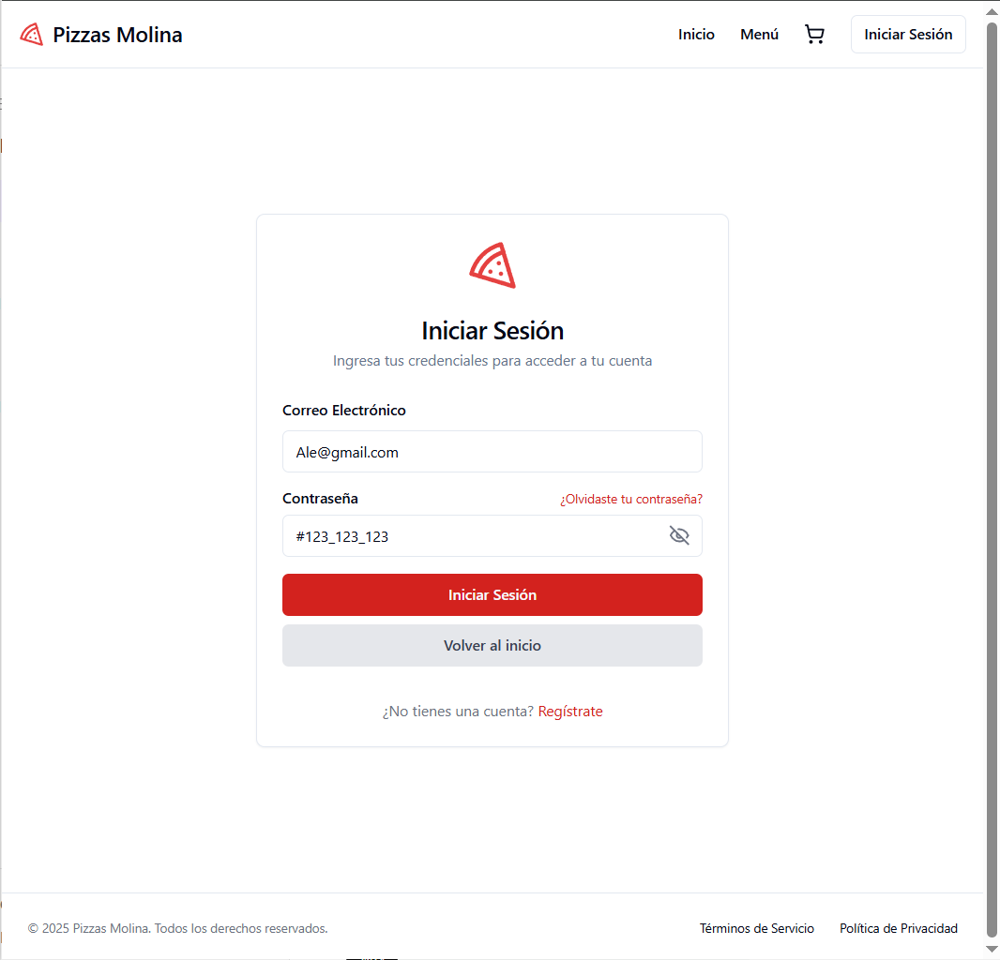

### 7. Agregar pizza al carrito de compra
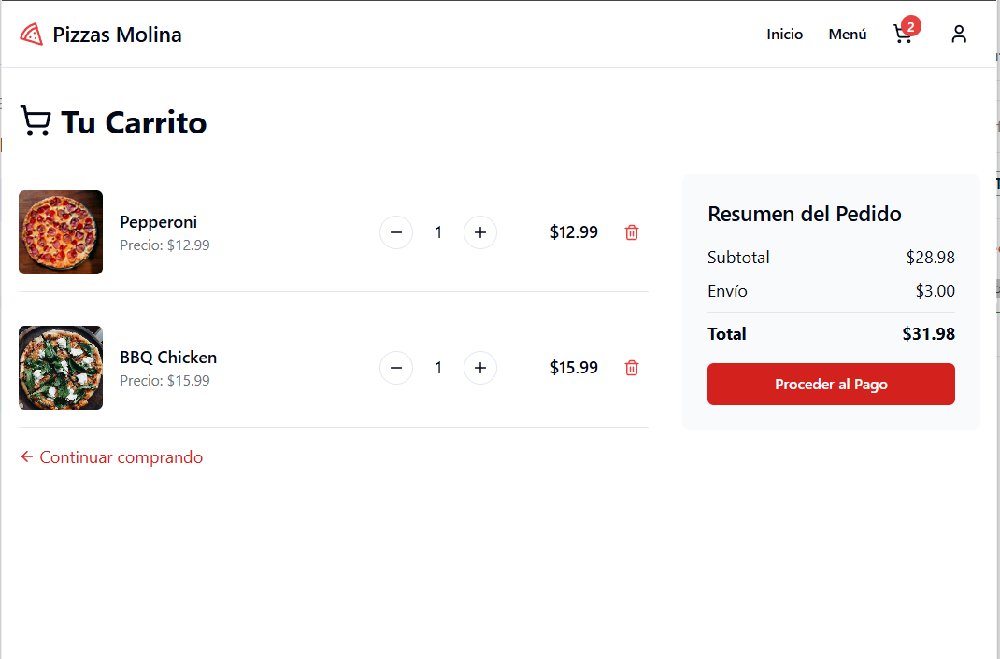

### 8. Datos de contacto para la compra
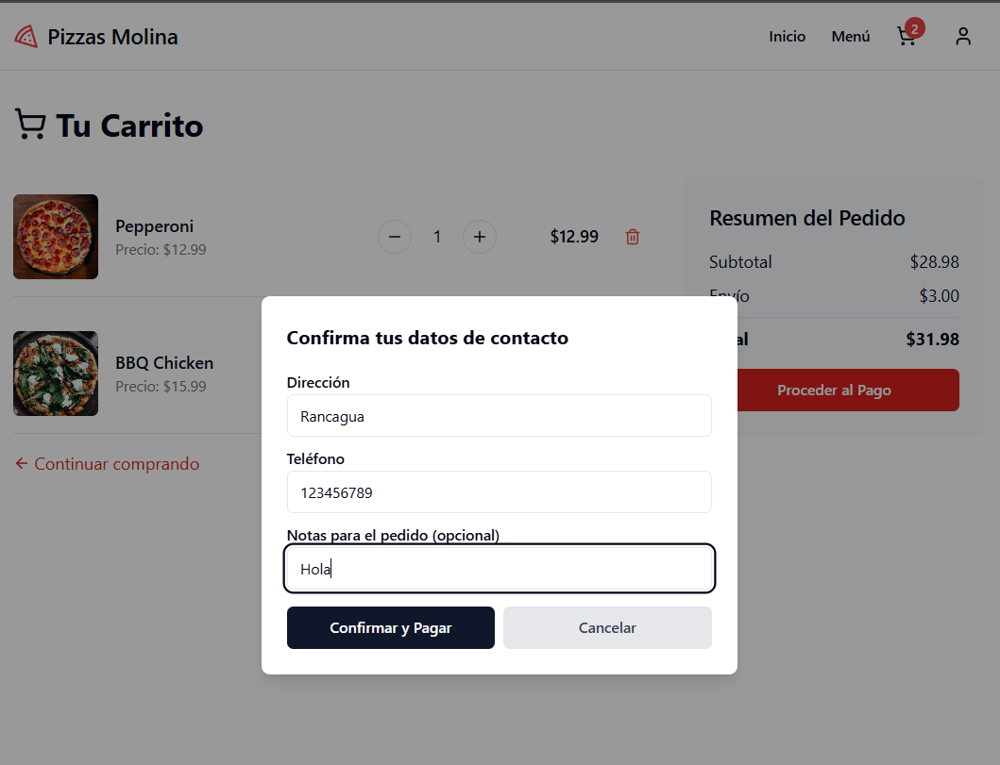

### 9. Datos de pago
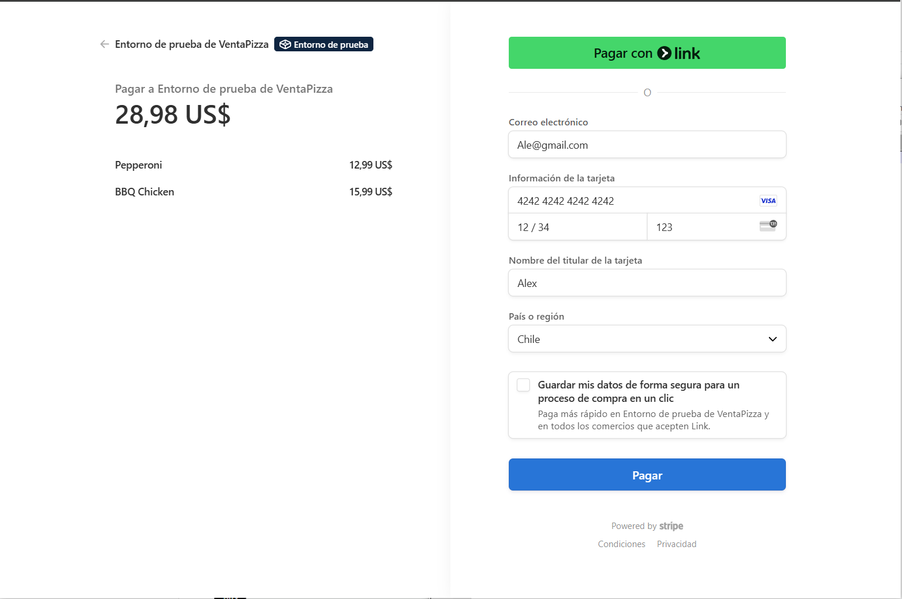

### 10. Pago finalizado
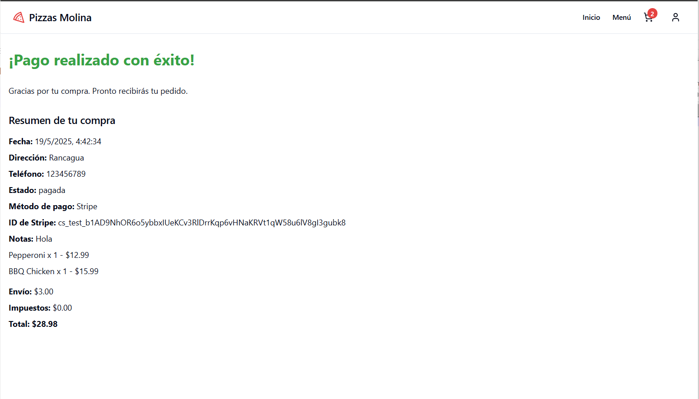

### 11. Mi historial de compras
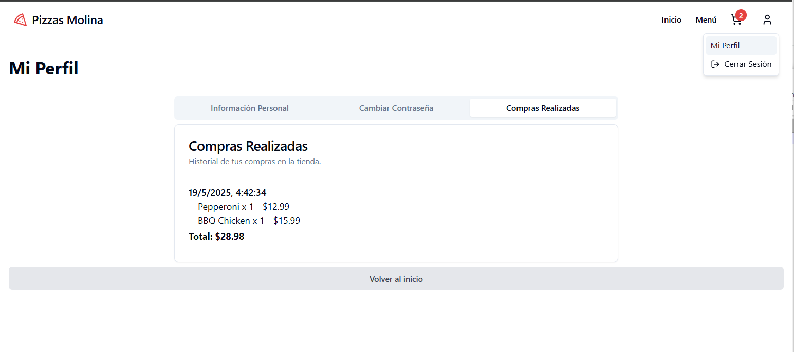

### 12. Información personal
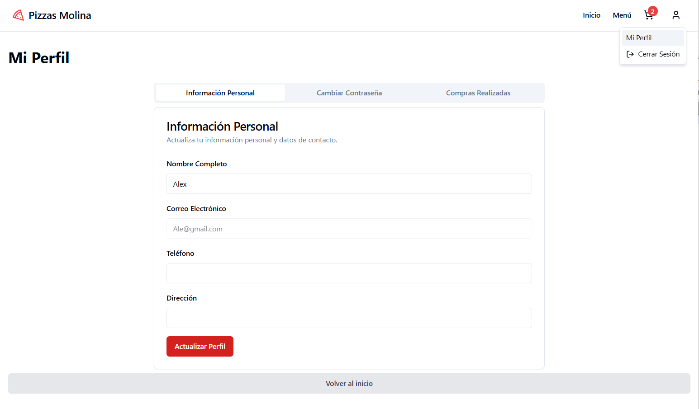

---

## 🆘 ¿Dudas o problemas?

- Revisa la documentación Swagger y este README.
- Si encuentras un bug, abre un issue en el repositorio de GitHub.
- ¡Disfruta tu pizza y tu código! 🍕🚀 